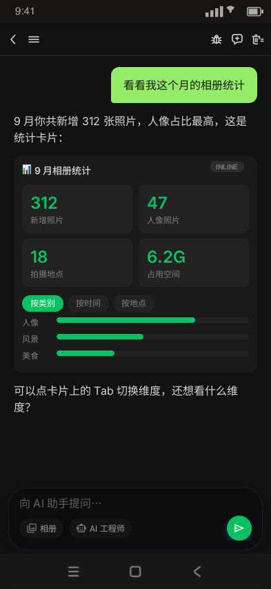
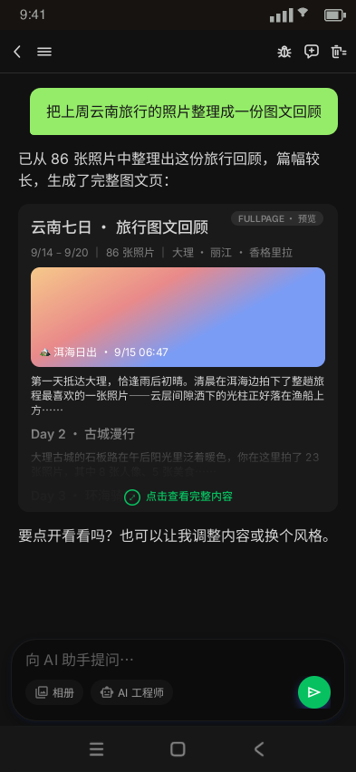
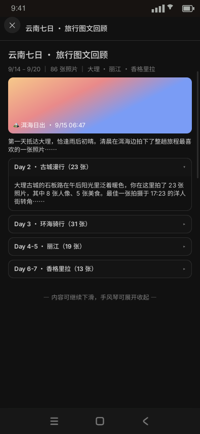
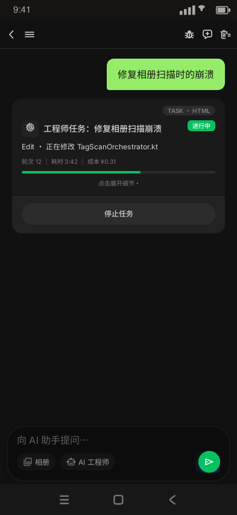
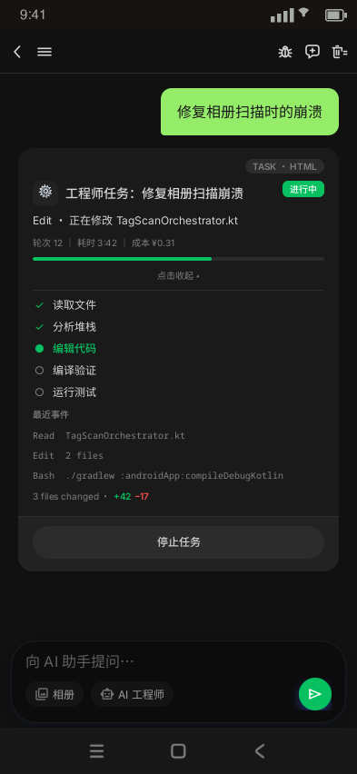
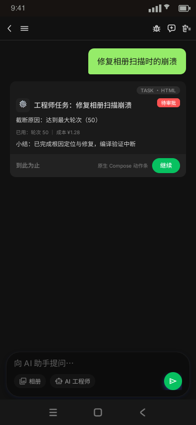
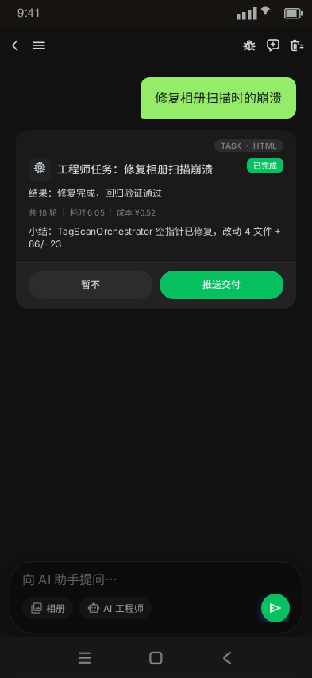
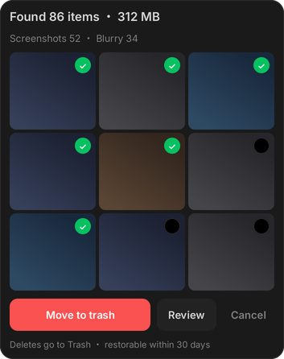
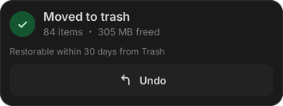

# Chat 卡片目录（数据 · UI 样式 · 渲染技术 SSOT）

> **定位**：聊天消息流中一切卡片/气泡的登记目录——每张卡片的三要素：**数据**（消息类型与 payload 模型）、**UI 样式**（Ardot 设计稿帧 + refs 图）、**渲染技术**（原生 Compose / SVG / WebView / L1 模板）。
> **日期**：2026-09-27 建立（覆盖 app v1.0.39 卡片现状 + 已定稿待实施项）
> **上游**：ADR-014（chat 富内容渲染）、ADR-016（parts 模型，宪法级）、`JS_ENGINE_TECH_SPEC.md` §7/§7.1（图表/HTML 卡实现 SSOT）、`2026-09-26-html-card-two-tier-design.md`（双形态 + 任务卡 HTML 化）
> **维护规则**：① 新增卡片 = 同一原子提交内登记本目录（数据/UI/渲染三列齐）；② 卡片视觉改版 = 先改 Ardot 画布 → 快照 refs → 回写本目录 UI 列与状态标注；③ 本目录只做登记与索引，实现细节以各上游文档为准，禁止反向漂移。

---

## 1. 渲染架构总览

### 1.1 路由点

主聊天流 = `androidApp/.../features/chat/ChatScreen.kt`：LazyColumn items 内 if/else 链（MEDIA_RESULTS → CHART → HTML_CARD → TASK_CARD → OPTIMIZE_CANDIDATES → 兜底 `ChatMessageItem`），`ChatMessageItem` 再按 isUser/isImage/isImageText/isEditResult 分气泡。已标 `@Suppress` 待重构抽分发器。

### 1.2 渲染技术四类

| 技术 | 机制 | 卡片 |
|---|---|---|
| **原生 Compose** | 直接组合，Coil 加载图 | 用户气泡、文本流、搜索结果卡、gacha 条、图片/编辑结果卡、确认弹窗 |
| **原生 SVG 栅格化** | androidsvg 渲染 ×2.5 位图 | 图表卡 |
| **WebView · LLM HTML** | 零 JS 桥沙箱 + 清洗器 + 动态测高 | HTML 卡（inline/fullpage 双形态） |
| **WebView · L1 端侧模板** | App 内模板 + 状态 JSON 组装，非 LLM 产物 | 工程师任务卡 |

### 1.3 横切机制（多卡片共用）

- **零 JS 桥沙箱**（ADR-014 D3）：WebView 禁文件/DOM Storage、远程 script 剔除、`HtmlCardSanitizer` 清洗（128KB 上限）；`<a>` 外链一律 `HtmlLinkPreviewOverlay` 落地页。
- **测高防抖三件套**（HTML 卡族）：测高 LruCache（按消息 id，任务卡 key 带形态域 `taskcard:<id>:exp|col`）+ 滑动冻结滚停应用 + <2px 抖动忽略；布局前虚高拦截。
- **双形态分流**（`HtmlCardDisplay` 纯函数）：display 声明 × 测高 → INLINE/FULLPAGE，终判随消息 metadata 持久化。
- **样式权威**：design-tokens.json → codegen 双端镜像（ADR-014 D5）；HTML/L1 模板 CSS 变量走 MaterialTheme tokens，Light/Dark 随主题。
- **媒体红线**（ADR-008）：相册图/编辑结果走原生消息（MEDIA_RESULTS/AGENT_IMAGE），不经 LLM 排版、不上传远程。

### 1.4 ADR-016 parts 模型（在途架构）

未来一条回复 = 有序 parts 数组（`MessagePart` sealed：Text/Chart/HtmlCard/TaskCard/MediaResults/Image/EditResult/OptimizeCandidates），本目录的卡片即 parts 的独立 block 清单；映射表见 `2026-09-27-chat-parts-rendering-design.md` §2。M1 实现在 worktree `.worktrees/chat-parts-m1`（未合入主树）。

---

## 2. 卡片总表

| 卡片 | ChatMessageType（Room type） | UI 组件 | 渲染技术 | 设计稿（Ardot） | 状态 |
|---|---|---|---|---|---|
| 用户气泡（文/图/图文） | USER_TEXT / USER_IMAGE / USER_IMAGE_TEXT | `ChatMessageItem` isUser 分支 | 原生 | `chat_user_bubble` 438:332 | ✅ |
| Agent 文本流（markdown） | AGENT_TEXT | `SegmentedAgentText` → MarkdownText | 原生（markdowntext 库） | chat-conversation 帧 | ✅ |
| 图表卡 | CHART（`chart`） | `ChartSvgCard` / `ChartSvgImage` | SVG 栅格化 | —（生成物无固定帧） | ✅ |
| HTML 卡（双形态） | HTML_CARD（`html_card`） | `HtmlCard` / `HtmlFullpageViewer` | WebView | `htmlcard/inline` 438:3 · `htmlcard/preview` 438:60 · `htmlcard/fullpage` 438:98 | ✅ |
| 工程师任务卡 | TASK_CARD（`task_card`） | `EngineerTaskCard` + 原生动作条 | WebView L1 模板 | `taskcard/*` 438:181/208/264/444:31 | ✅（两分区改版待实现迁移） |
| 搜索结果卡 | MEDIA_RESULTS（`media_results`） | `MediaResultsCarousel` | 原生 | `chat_photo_card` 387:143 | ✅ |
| 抽卡候选条 | OPTIMIZE_CANDIDATES | `GachaCandidateStrip` | 原生 | —（设计稿已随交付清理，git 历史可查） | ✅ |
| Agent 图片结果卡 | AGENT_IMAGE | `ChatMessageItem` isImage 分支 | 原生 | —（跟随会话帧） | ✅ |
| 编辑结果卡 | AGENT_EDIT_RESULT | isEditResult 分支 | 原生 | — | ✅ |
| Claude 步骤附加区 | AGENT_TEXT + metadata `claude_agent_state` | `AgentMessageExtras` / `ClaudeAgentSteps` | 原生 | — | ✅ |
| 日期分隔 | （列表装饰，非消息） | `ChatDateChip` | 原生 | `chat_date_chip` 438:335 | ✅ |
| 游客引导卡 | （无消息，sheet） | `ChatRegistrationSheet` + `GuestNudgeBanner` | 原生 | `chat_nudge_card` 438:357 | ✅ |
| 清理确认/完成卡 | （写确认/清理流程 UI） | AlertDialog（`ChatScreen.kt` 写确认管线） | 原生 | `chat_cleanup_card` 438:397 · `chat_cleanup_done_card` 438:409 | ✅（三要素升级待实施） |
| 写操作确认弹窗 | （JS `capability.dispatch` 触发） | `WriteConfirmationController` + AlertDialog | 原生 | 同上（确认卡皮） | ✅ |
| 审批三要素卡 | — | — | 原生（规划） | 待画 | 📋 spec 定稿待实施 |
| 任务中心列表项 | （页面卡，非消息流） | `UserTaskCard` / EngineerTask 紧凑项 | 原生 | `chat-task_center` 帧 | ✅ |
| 浮动 AI 面板体系 | 独立 sealed `AgentMessage` | `ChatBubble` 系（AiChatScreen） | 原生 | — | ✅（平行体系，§6） |

> parts 映射：`USER_TEXT/AGENT_TEXT→Text`、`CHART→Chart`、`HTML_CARD→HtmlCard`、`TASK_CARD→TaskCard`、`MEDIA_RESULTS→MediaResults`、`USER_IMAGE(_TEXT)→Image(+Text)`、`AGENT_IMAGE/AGENT_EDIT_RESULT→Image/EditResult`、`OPTIMIZE_CANDIDATES→OptimizeCandidates`、`COMMAND/PLAN_PREVIEW→metadata 或专用 part`（实施时定）。

---

## 3. 基础消息形态

### 3.1 用户气泡

- **数据**：`USER_TEXT` / `USER_IMAGE` / `USER_IMAGE_TEXT`（content + imageUri）。
- **UI**：绿底深字，`chatBubble/userBubbleBg` #95EC69（双模恒值）/ `userBubbleOn` #181818；hug 尺寸 pad 18h/14v，右对齐；深字对齐 token `$143:12`。
  
- **渲染**：原生 Compose（`ChatBubbleTokens`，`core/designsystem/DesignTokens.kt`）；图片走 Coil。

### 3.2 Agent 文本流（markdown）

- **数据**：`AGENT_TEXT`（content + metadata：claude_agent_state / LlmPerformance / imageUri 等多用途挂载）。错误气泡（⚠️ 前缀）与发送失败也落此 type。
- **UI**：通栏无气泡皮；流式态 `TypingIndicator`/`BlinkCursor`。
- **渲染**：shared `MarkdownSegmenter`（MARKDOWN/TABLE/CODE 三段）→ `MarkdownText`（`dev.jeziellago.compose:markdowntext`）+ 纯 Compose `AgentTable`（点击进 `TablePreviewOverlay`）+ `CodeBlock`（>12 行折叠 + 复制）。ADR-016 D2 规划升格 markdown AST → 原生受控组件（替 compose-markdown）。
- **附加区**：`ClaudeAgentSteps`（步骤 RUNNING⏳/SUCCESS✓/FAILED✗ + 截断继续条 + 交付 push/pr/auto 按钮，TASK_CARD 在场时抑制）；`MessagePerformanceRow`。

### 3.3 日期分隔

`chat_date_chip`（surfaceContainerHigh 底 r8 胶囊），列表装饰非消息。

---

## 4. 富内容卡片

### 4.1 图表卡 `ChartSvgCard`

- **数据**：`CHART`，content=SVG 字符串。来源双通道：① LLM tool_call `draw_chart(type,title,labels,values,unit)`；② 脚本 `return Chart.x(...)` 拦截。生成器 `assets/js/chart_bootstrap.js`（QuickJS 端侧，`Chart.bar/line/pie/timeline`，返回 `{chart, summary}`，summary 回传 LLM）。prompt 契约：draw_chart 是图表唯一通路，禁 markdown 表格/ASCII 画图。
- **UI**：无固定设计帧（端侧生成物）；点击进 `ChartPreviewOverlay` 全屏。
- **渲染**：androidsvg 栅格化 ×2.5 位图；渲染中占位文案。
- **parts**：`Chart(svg)`，payload 不变。
- **测试**：`GalleryJsTest` / `ChatRunScriptCapabilityTest` / golden `chat_tool_inventory_golden.txt`。

### 4.2 HTML 卡 `HtmlCard`（双形态）+ 全屏查看器 + 外链落地页

- **数据**：`HTML_CARD`，`ChatMessage.htmlContent` + `HtmlCardMeta`（display 声明/displayMode 终判/measuredHeightPx/summary，Room metadata `html_card`）。来源：LLM `render_html(html, summary, display?)` → `HtmlCardSanitizer` 清洗 → 落库；summary 回传 LLM。
- **UI**（Ardot HtmlCard 页）：

  | 形态 | 帧 | 说明 |
  |---|---|---|
  | Inline 短卡 | `htmlcard/inline` 438:3 | 动态测高完全撑开，卡内直接交互 |
  | Fullpage 预览 | `htmlcard/preview` 438:60 | 0.5 屏固定高 + 底部渐隐遮罩 + 「点击查看完整内容」提示条 |
  | 全屏查看器 | `htmlcard/fullpage` 438:98 | ✕ 顶栏 + 竖滚 + 滚动条 |

    
- **渲染**：WebView 零桥沙箱；`wrapHtmlDocument` 注入 viewport + 响应式 reset；`HtmlCardDisplay` 纯函数分流（display==fullpage 直判；否则测高 >1.0 屏强制 FULLPAGE；终判落 metadata 防跳变）；Inline 测高 = console 出站求值 + ResizeObserver 跟随 + 防抖三件套；Fullpage 触控层吃点击不吃竖拖；`HtmlLinkPreviewOverlay`（`<a>` 落地页，DOM Storage 开）。渲染失败 → 原生封面兜底。
- **调试**：DEBUG `/html` 注入十一张冒烟卡（`HtmlCardSmokeSamples`）。
- **parts**：`HtmlCard(html, display)`。
- **测试**：`HtmlCardDisplayTest` / `HtmlCardSanitizerTest` / `HtmlSandboxGuardTest`。

### 4.3 工程师任务卡（TASK_CARD）

- **数据**：`TASK_CARD`，`EngineerTaskState`（shared `domain/chat/EngineerTaskState.kt`，Room metadata `engineer_task`；事件源 ClaudeEvent SSE，状态机 `EngineerTaskReducer`）。五态：RUNNING / AWAITING_CONTINUE / AWAITING_DELIVER / COMPLETED / FAILED × resolution（CONTINUED/ABANDONED/DELIVERED/DELIVER_SKIPPED）。
- **UI**（2026-09-27 两分区改版，Muse 风格——上半 InfoZone 任务信息、下半 ActionZone 用户选项/按钮，**画布已定稿、App 实现待迁移**）：

  | 态 | 帧 | 下半部动作区 |
  |---|---|---|
  | running 折叠 | `taskcard/collapsed` 438:181 | 整宽胶囊 [停止] |
  | running 展开 | `taskcard/expanded` 438:208 | 同上（信息区含时间线/事件/diff） |
  | 待审批 | `taskcard/approval` 438:264 | radio 选项列表（继续执行/到此为止） |
  | 完成 | `taskcard/done` 444:31 | [暂不｜推送交付] 双按钮 |

     
- **渲染**：端侧 L1 模板（`EngineerTaskHtml` 组装完整 HTML，CSS 变量走 tokens）经 `HtmlCard` 双形态渲染（cardColor/cardShape/contentPadding/onInlineCardTap 参数化）；displayMode 粘滞不落库；500ms 合帧节流（`EngineerTaskThrottle`）；状态文本 HTML escape（唯一注入面）。**现实现**：审批动作条原生外置卡底（running=[停止]/截断=[继续|到此为止]/可交付=[交付 push|暂不]/失败=[重试]），停止 = resolve ABANDONED + 取消 SSE（CancellationException 穿透不产错误气泡）；组装失败 → 原生兜底卡。任务中心页列表项保持原生紧凑形态。
- **parts**：`TaskCard(toolCallId, state)`——五态映射 Vercel 工具状态机 + 审批态。
- **测试**：`EngineerTaskHtmlTest` / `EngineerTaskReducerTest` / `EngineerTaskStateSerdeTest` / `ChatViewModelEngineerTaskTest` / `TaskCenterPartitionTest`；冒烟 `/task`（`EngineerTaskSmokeSamples` 五态 + 超屏样本）。

### 4.4 相册搜索结果卡 `MediaResultsCarousel`

- **数据**：`MEDIA_RESULTS`，`MediaResultsUi`（query/assets/totalCount/isRefinement/feedbackState）。来源：搜索工具/脚本补卡。
- **UI**：`chat_photo_card` 组件（120×150 照片卡 + 👍/👎/🔁 反馈钮列 + DateChip 角标）横滑轮播。
  
- **渲染**：原生 Compose（LazyRow + Coil）；媒体被删后同步收缩。
- **parts**：`MediaResults(assets)`——data part 性质，不回灌 LLM。
- **测试**：`ChatGallerySearchTest` / `SearchSnapshotBuilderTest`。

### 4.5 AI 优化抽卡候选条 `GachaCandidateStrip`

- **数据**：`OPTIMIZE_CANDIDATES`，`OptimizeCandidateGroup`（Room metadata）；控制器 `ChatOptimizeGachaController`。
- **UI**：设计稿已随交付清理（git 历史可查）；现实现 = 选中高亮/换一组 loading/护栏 rejected/进程重建只读态；确认后消息改写为 agent_image。
- **渲染**：原生 Compose。
- **parts**：`OptimizeCandidates(...)`。
- **测试**：`ChatViewModelGachaTest` / `OptimizeCandidateGroupTest` / `ChatOptimizeGachaControllerTest`。

### 4.6 Agent 图片结果卡 / 编辑结果卡

- **数据**：`AGENT_IMAGE`（metadata imageUri/saved）/ `AGENT_EDIT_RESULT`（图 + 说明）。
- **UI**：通栏结果图（存活）/ `ExpiredImagePlaceholder` 灰框过期占位（LRU 清理后）。
- **渲染**：原生 Compose（Coil `AsyncImage`；`ChatImageLive` 判定存活）；点击进 `ChatImagePreviewOverlay`（保存/删除/OCR）。
- **parts**：`Image(ref)` / `EditResult(...)`——媒体红线：不经 LLM 排版。
- **测试**：`ChatImageLiveTest` / `ChatImageRenderer*Test` / `ChatViewModelEditResultTest` / `ImagePreviewPagesBuilderTest`。

### 4.7 流程卡：清理确认/完成 · 游客引导 · 写操作确认

| 卡 | 组件（438 页组件） | 数据/触发 | 代码 |
|---|---|---|---|
| 清理确认卡 | `chat_cleanup_card` 438:397（9 宫格缩略 + 宽主钮 + 双次钮） | 清理流程确认 | 设计正典；代码侧写确认 AlertDialog 简化形态 |
| 清理完成卡 | `chat_cleanup_done_card` 438:409（✓ + 标题 + caption） | 清理完成回显 | 同上 |
| 游客引导卡 | `chat_nudge_card` 438:357（r28 sheet + 注册主钮） | 游客态注册引导 | `ChatRegistrationSheet` + `GuestNudgeBanner` |
| 写操作确认 | —（同确认卡皮） | JS `capability.dispatch` 写操作 → `PendingWriteConfirmation`（120s 超时/串行互斥/source JS\|TOOL_CALL） | `WriteConfirmationController` + ChatScreen AlertDialog |

  

---

## 5. 规划中卡片

### 5.1 审批三要素卡（📋 spec 定稿待实施）

DESTRUCTIVE 批量删除的聚合确认卡：数量 + 珍贵信号（收藏/老照片）+ 可恢复性三要素；双链路（JS 写通路 + Tier B 批量阈值 3）；形态 = 升级确认对话框（不做 chat 内审批卡）。spec：`docs/superpowers/specs/2026-09-26-approval-three-element-card-design.md`。

### 5.2 ADR-016 parts 模型迁移（🚧 M1 worktree 在途）

一条回复 = parts 文档，卡片 = 独立 block；Turn 聚合渲染；markdown AST 管线换代。卡片 UI/渲染形态**不变**（ADR-016 D2），本目录卡片清单即 block 清单。M1 代码在 `.worktrees/chat-parts-m1`（MessagePart/MessagePartsCodec/LegacyMessageParts），未合入主树。

---

## 6. 平行渲染体系（非主聊天流，登记备查)

| 体系 | 模型 | 说明 |
|---|---|---|
| 浮动 AI 面板（`features/common/chat/`） | sealed `AgentMessage`（UserText/AgentText/CommandExecution/PlanPreview/PlanProgress/PlanResult） | 相机/相册页内嵌面板，`COMMAND`/`PLAN_PREVIEW` 两消息类型的真正消费者在此 |
| 悬浮聊天气泡（`service/chat/FloatingChatBubbleService`） | 复用主 `ChatViewModel.displayMessages` | 仅 Text/markdownText 简化气泡，无富卡 |
| 任务中心（`features/chat/taskcenter/`） | `UserTask` 域模型 + EngineerTask 分区 | `UserTaskCard` 原生列表项（PENDING/RUNNING/PAUSED/FAILED/终态 + supportedActions 按钮） |
| iOS 对等（`iosApp/PoLang/Features/Chat/`） | Swift 原生 `ChatMessage`（未消费 shared 模型） | ChartSvgCard.swift/GachaCandidateStrip.swift 等对等实现，走 /ios-follow 对齐 |

---

## 7. 测试与冒烟入口汇总

- **单测**：见各卡片小节；DAO 层 `ChatMessageDaoTest`；shared `MarkdownSegmenterTest` / `StreamingPacingControllerTest`。
- **ui-driver 冒烟**（DEV_ONLY，DEBUG 构建）：`/html` → `HtmlCardSmokeSamples`（十一卡含双形态/远程/ALL_IN_ONE）；`/task` → `EngineerTaskSmokeSamples`（五态 + 超屏展开）。
- **设计稿验收**：health-check（`scripts/ardot-health-check.py`）+ Light 双模（`scripts/ardot-light-verify.py`）+ refs 快照（`scripts/export-ardot-snapshot.py`）。

## 8. 文档索引

| 主题 | 文档 |
|---|---|
| 渲染架构宪法 | `docs/02-ARCHITECTURE/ADR/ADR-016-chat-parts-model-mainstream-alignment.md`（+ 实施 spec 2026-09-27-chat-parts-rendering-design） |
| 富内容渲染决策 | ADR-014（含 D1~D6） |
| HTML/图表/脚本实现 SSOT | `docs/03-TECHNICAL-SPECS/JS_ENGINE_TECH_SPEC.md` §5/§7/§7.1 |
| 双形态 + 任务卡 HTML 化 | `docs/superpowers/specs/2026-09-26-html-card-two-tier-design.md` |
| 任务卡产品线 | `docs/superpowers/specs/2026-09-25-engineer-task-card-design.md` · UserTask 协议 2026-09-26 |
| 设计稿 | Ardot polang-ui-spec（fileId 715061534788814）HtmlCard 页 438:2 · ChatComponents 页 438:328；refs `docs/08-UI-SPECS/screens/refs/ardot/` |
| 样式 tokens | `docs/03-TECHNICAL-SPECS/DESIGN_TOKENS_SPEC.md` |
