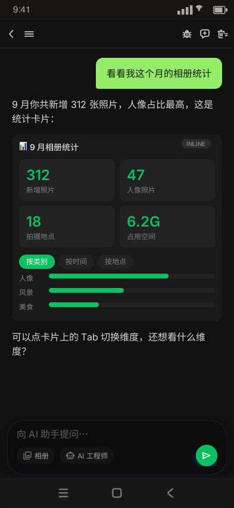
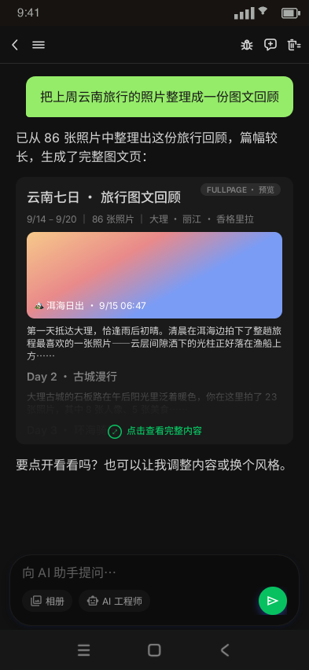
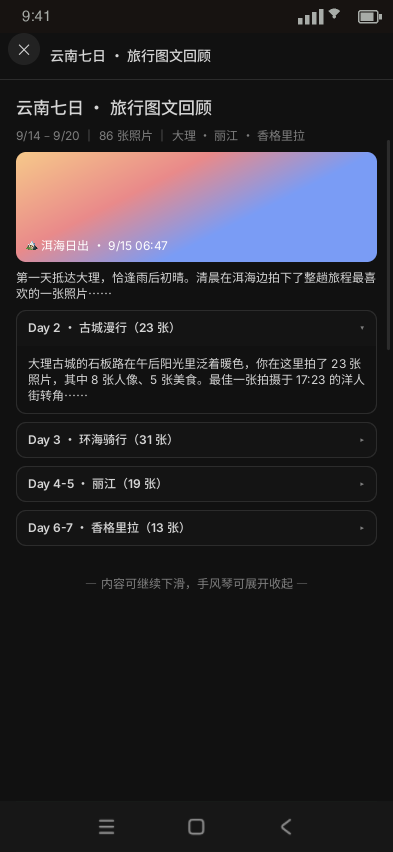
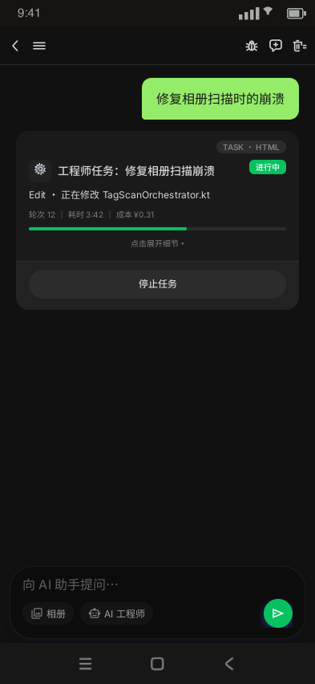
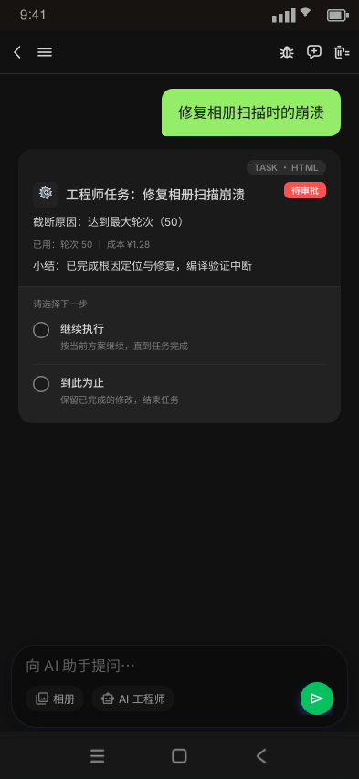
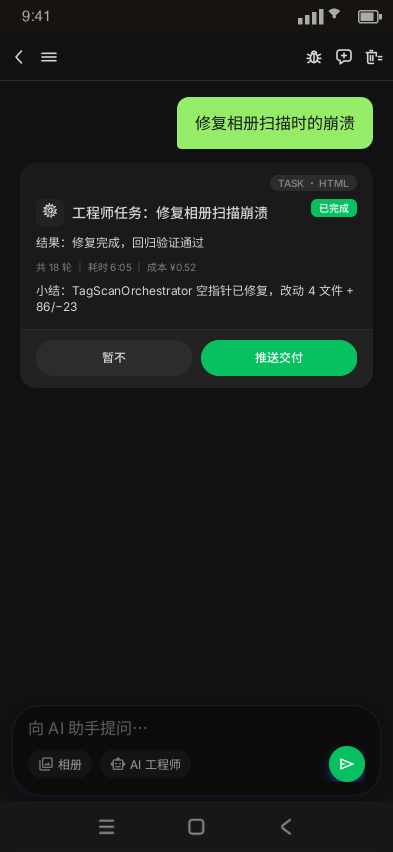
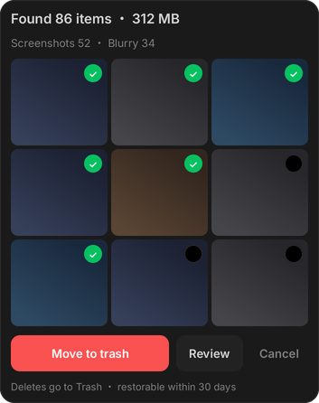

# Chat 卡片目录（数据 · UI 样式 · 渲染技术 SSOT）

> **定位**：聊天消息流中一切卡片/气泡的登记目录——每张卡片给出**协议实例**（入口 tool_call JSON + Room 落库 JSON）、**UI 样式**（Ardot 设计稿帧 + refs 图）、**渲染技术**（渲染组件与机制）。
> **日期**：2026-09-27 建立（覆盖 app v1.0.39 卡片现状 + 已定稿待实施项）
> **上游**：ADR-016（chat 消息内容模型与渲染架构，宪法级——已整合原 ADR-014）、`JS_ENGINE_TECH_SPEC.md` §7/§7.1（图表/HTML 卡实现 SSOT）、`2026-09-26-html-card-two-tier-design.md`（双形态 + 任务卡 HTML 化）
> **维护规则**：① 新增卡片 = 同一原子提交内登记本目录（协议/UI/渲染三列齐）；② 卡片视觉改版 = 先改 Ardot 画布 → 快照 refs → 回写本目录 UI 列与状态标注；③ 本目录只做登记与索引，实现细节以各上游文档为准，禁止反向漂移；④ 协议演进（parts/回灌）须过 §0.3 OpenAI 兼容对照六条硬约束。

---

## 0. 协议总纲（读例前必读）

**两级协议形态**：

1. **入口协议**（LLM → App）：OpenAI 兼容 tool_calls，`name` + `arguments`（JSON 字符串，定义在 `shared/.../inference/remote/tool/ChatToolService.kt` `@Tool`）。
2. **落库协议**（App → Room → 渲染）：`chat_messages` 表一行（`androidApp/.../data/local/ChatMessageEntity.kt`），卡片差异化负载全部收在 `content` + `metadata`（JSON 字符串）两列。

> 📌 **读例约定**：下文所有 `metadata` / `tool_call.arguments` / `content` 内嵌 JSON 一律**展开为对象/数组示意**（带注释）；实际 Room 存储为其序列化字符串。

```jsonc
// chat_messages 表结构（Room 实体，逐列）
{
  "id": "uuid 或 taskId", // 任务卡特例：id = taskId，REPLACE upsert
  "sessionId": "default",
  "type": "…", // 13 值之一，见下
  "content": "…", // 按 type 语义不同，见各卡
  "timestamp": 1790000000000,
  "modelUsed": "deepseek-chat", // 可空
  "metadata": { "…": "…" } // 卡片专属负载包（实际存储为 JSON 字符串）
}
```

`type` 全集：`user_text` · `agent_text` · `user_image` · `user_image_text` · `agent_image` · `command` · `plan_preview` · `media_results` · `chart` · `html_card` · `agent_edit_result` · `optimize_candidates` · `task_card`

**反序列化路由**：`ChatViewModel.toUiModel()`（ChatViewModel.kt:3383）按 type 取 content/metadata 各字段 → `ChatMessage`（shared `domain/chat/ChatMessage.kt`，双端 SSOT）→ `ChatScreen.kt` LazyColumn if/else 链选渲染组件。

### 0.1 协议一致性现状与在途重构（2026-09-27）

**legacy 13-type 协议本身不统一**——这正是 ADR-016 parts 重构的动机，盘点如下（下文各卡「落库协议」示例均为 legacy 形态，即迁移源）：

| 不统一点 | 现状 |
|---|---|
| `content` 列语义 | 按 type 共 6 种：markdown 文本 / SVG 串（chart）/ HTML 串（html_card）/ JSON 数组（media_results）/ sourceText 前 50 字（task_card）/ 空串占位（optimize_candidates） |
| `metadata` 挂载风格 | 3 种：① 键包裹单对象（`html_card`/`engineer_task`/`claude_agent_state`/optimize 全量）② 字段直挂顶层（性能 6 字段）③ 平铺小对象（`imageUri`+`saved`、`query`+`totalCount`+`isRefinement`） |
| `id` / `timestamp` 语义特例 | task_card：id=taskId（REPLACE upsert）、timestamp=startedAtMs（锚定提交位置） |
| serde 位置 | org.json 扩展在 androidApp shim（`ChatModelCommonMainShim.kt`），非 commonMain 纯 Kotlin |
| 僵尸类型 | `command` / `plan_preview` 主聊天流无专属渲染分支（真正消费者在平行浮动面板体系，§6） |

**在途重构（另一 kimi-code 会话实施中，worktree `.worktrees/chat-parts-m1`，未合入主树）**：按 ADR-016 对齐 OpenAI Responses / Vercel parts 协议——Room 增 `partsJson` 列，一条消息 = 有序 parts 数组，kotlinx JSON 鉴别字段 `type`（值与 legacy type 列对齐），`ignoreUnknownKeys` 前向兼容 + `encodeDefaults=false` 紧凑落库；legacy 三列经 `LegacyMessagePartsConverter` 全枚举迁移，**行级 Text 兜底不允许丢消息**。目标线格式：

```jsonc
// partsJson 列（M1 在途；encodeDefaults=false → state="DONE"/saved=false 等缺省字段不写出）
[
  { "type": "text", "partId": "p0", "markdown": "已定位崩溃根因：…" },
  {
    "type": "task_card",
    "partId": "p1",
    "toolCallId": "task-01JD2Z…",
    "state": "APPROVAL_REQUESTED",        // ToolPartState 七态（Vercel 对齐）；M1 仅持久化枚举，流式语义属 M2
    "task": { "…": "EngineerTaskState 全量，同 §4.3" }
  },
  {
    "type": "html_card",
    "partId": "p2",
    "html": "<div style='width:100%…'>…</div>",
    "meta": { "display": "fullpage", "displayMode": "FULLPAGE", "summary": "NVIDIA 2026 Q3 业绩概览" }
  }
]
```

迁移合入后，本目录各卡「落库协议」示例将统一切换为 partsJson 形态（届时 legacy 三列仅作迁移源保留）。

### 0.2 目标协议（parts 形态）逐类型示例

字段名与缺省省略行为以 worktree `MessagePartsCodec`（kotlinx JSON，`encodeDefaults=false`）为准，round-trip 有单测锁定（`MessagePartsCodecTest`）。**缺省值不写出**：`state="DONE"`、`saved=false`、空集合、`null` 默认字段一律省略，解码回填。

```jsonc
// text ← user_text / agent_text / command / plan_preview（一条回复可多段交错）
{
  "type": "text",
  "partId": "p0",
  "markdown": "已定位崩溃根因：…"          // state 仅 STREAMING 时写出（DONE 为缺省）
}

// chart ← chart
{
  "type": "chart",
  "partId": "p1",
  "svg": "<svg xmlns='http://www.w3.org/2000/svg' viewBox='0 0 360 240'>…柱状图元素…</svg>"
}

// html_card ← html_card（meta 四字段与 legacy metadata.html_card 键一致，随迁）
{
  "type": "html_card",
  "partId": "p2",
  "html": "<div style='width:100%…'>…</div>",
  "meta": {
    "display": "fullpage",
    "displayMode": "FULLPAGE",
    "measuredHeightPx": null,
    "summary": "NVIDIA 2026 Q3 业绩概览"
  }
}

// task_card ← task_card（state = ToolPartState 七态投影；task 内字段与 legacy engineer_task 键同名）
{
  "type": "task_card",
  "partId": "p3",
  "toolCallId": "task-01JD2Z…",           // M1 = taskId；M2 流式起为真实 chunk id
  "state": "APPROVAL_REQUESTED",
  "task": {
    "taskId": "task-01JD2Z…",
    "sourceText": "修复相册扫描时的崩溃",
    "sid": "claude-9a…",
    "status": "AWAITING_CONTINUE",
    "stage": "Edit · TagScanOrchestrator.kt",
    "recentStages": ["读取文件", "分析堆栈", "编辑代码"],
    "turns": 50,
    "costCents": 128,
    "startedAtMs": 1790000000000,
    "updatedAtMs": 1790000217000,
    "fileChangeCount": 3,
    "truncatedReason": "达到最大轮次（50）",
    "errorSummary": null,
    "resultSummary": "已完成根因定位与修复，编译验证中断",
    "resolution": null,
    "deliverBranch": null
  }
}

// media_results ← media_results（data part：默认不回灌 LLM）
{
  "type": "media_results",
  "partId": "p4",
  "results": {
    "query": "去年夏天的海边",
    "assets": [
      {
        "id": 1024,
        "uri": "content://media/external/images/media/1024",
        "type": "PHOTO",
        "captureDate": 1757000000000,
        "fileName": "IMG_20260805.jpg",
        "faceFocusY": 0.42
      }
    ],
    "totalCount": 87,
    "isRefinement": false,
    "feedbackState": { "1024": "LIKE" }   // 空 Map 为缺省不写出
  }
}

// image ← user_image / agent_image / user_image_text 的图（媒体红线：原生 block，不经 LLM 排版）
{
  "type": "image",
  "partId": "p5",
  "ref": "content://media/external/images/media/1024"   // user 图：saved=false 缺省不写出
}

{
  "type": "image",
  "partId": "p5",
  "ref": "file:///data/…/result.webp",
  "saved": true                                          // agent 产物图已保存到相册
}

// edit_result ← agent_edit_result
{
  "type": "edit_result",
  "partId": "p6",
  "ref": "file:///data/…/edit.webp",     // null（legacy metadata 缺失）时整个键不写出，UI 落 legacy 兜底
  "description": "已完成背景替换：海边 · 保留人物主体",
  "suggestions": ["再亮一点", "换成黄昏"]   // 空数组为缺省不写出
}

// optimize_candidates ← optimize_candidates（data part：默认不回灌 LLM）
{
  "type": "optimize_candidates",
  "partId": "p7",
  "group": { "…": "OptimizeCandidateGroup 全量，字段与 legacy metadata 键同名，见 §4.5" }
}
```

**legacy type → part 迁移映射**（`LegacyMessagePartsConverter` 实况，M1）：

| legacy type | 转换产物 |
|---|---|
| `user_text` / `agent_text` / `command` / `plan_preview` | `Text(markdown=content)`（claude_agent_state 步骤流 M1 不进 parts，随后续里程碑定表达） |
| `user_image` | `Image(ref=content)`（content 列即图片路径） |
| `user_image_text` | `Image(metadata.imageUri)` + `Text`（图上文下，顺序即展示顺序） |
| `agent_image` | `Image(ref, saved)` |
| `agent_edit_result` | `EditResult(ref, description=content, suggestions, saved)` |
| `media_results` | `MediaResults`（content 数组 + metadata 三字段合一） |
| `chart` | `Chart(svg=content)` |
| `html_card` | `HtmlCard(html=content, meta)` |
| `task_card` | `TaskCard`（taskId 兼任 toolCallId） |
| `optimize_candidates` | `OptimizeCandidates` |
| 任意行转换失败/未知类型 | 行级兜底 `Text(content)`，不允许丢消息 |

### 0.3 OpenAI 协议兼容对照（目标协议硬约束）

ADR-016 对齐的「主流协议」中，OpenAI 是传输层实际采用的家族（远程推理 = OpenAI 兼容 Chat Completions，经 Koog；Responses API 为概念对齐参照）。parts 模型**命名取 Vercel（partId/markdown），语义须与 OpenAI 无损互转**——本节是重构与新增 part 类型的兼容验收清单。

**① 概念对照**：

| PoLang part | OpenAI Responses item | Chat Completions 概念 |
|---|---|---|
| `Text(markdown)` | `message`（content `output_text`/`input_text`） | `assistant`/`user` 消息 content |
| `Chart` / `HtmlCard` / `TaskCard` | `function_call` + `function_call_output` **对**（靠 `call_id` 关联） | `assistant.tool_calls[]` + `tool` 角色消息**对**（靠 `tool_call_id` 关联） |
| `MediaResults` / `OptimizeCandidates` | 无对应（UI data，回灌剥离——对齐 Vercel `convertToModelMessages` 丢弃规则） | 不进上下文 |
| `Image`(user 图) | 不映射 `input_image`——**媒体红线：本地 uri 不外发**（ADR-008） | 同左 |
| `partId` | item `id`（本地 UI key） | —（消息级即可） |
| `toolCallId` | **`call_id`**（须可原样回显） | **`tool_call_id` / tool_calls[].id** |

**② 生命周期对照**（`ToolPartState` ↔ OpenAI item `status` + 流式事件；三段式 chunk = start/delta/end 的事件语义对齐，非 SSE 线协议）：

| ToolPartState | OpenAI 语义 | 流式事件锚 |
|---|---|---|
| `INPUT_STREAMING` | arguments 增量中（`status:"in_progress"`） | `response.function_call_arguments.delta` |
| `INPUT_AVAILABLE` | arguments 完整、调用就绪 | `response.function_call_arguments.done` |
| `OUTPUT_AVAILABLE` | `function_call_output` 已回（`status:"completed"`） | `response.output_item.done` |
| `OUTPUT_ERROR` | `status:"failed"` | 同上（错误态） |
| `APPROVAL_REQUESTED` / `APPROVAL_RESPONDED` / `OUTPUT_DENIED` | OpenAI 核心无对应——Vercel v6 / Agents SDK human-in-the-loop 扩展位 | — |

（块级 start ↔ `response.output_item.added`；工程师任务卡五态经 `toToolPartState()` 投影到本表。）

**③ 回灌线格式示例**（`ChatMessage.toModelInput()` 的目标形态，spec §6；Chat Completions 为实际线协议）：

```jsonc
// parts 文档（§0.2 示例）→ 回灌 messages 数组：Text 进 content，工具 part 拆 tool-call/tool-result 对
[
  { "role": "user", "content": "修复相册扫描时的崩溃" },
  {
    "role": "assistant",
    "content": "已定位崩溃根因：…",                       // Text part
    "tool_calls": [
      {
        "id": "call-h9…",                                // = part.toolCallId，须与下行 tool_call_id 一致
        "type": "function",
        "function": {
          "name": "render_html",                         // Chart→draw_chart / HtmlCard→render_html
          "arguments": "{\"html\":\"…\",\"summary\":\"NVIDIA 2026 Q3 业绩概览\",\"display\":\"fullpage\"}"
        }                                                // arguments 恒为 JSON 字符串（OpenAI 线格式）
      }
    ]
  },
  { "role": "tool", "tool_call_id": "call-h9…", "content": "{\"summary\":\"NVIDIA 2026 Q3 业绩概览\"}" }
]
```

**④ 兼容性硬约束**（新增/改 part 类型必须逐条过）：

1. **配对完整**：回灌时每个工具 part 必须产出 tool-call + tool-result 两条且 `call_id` 两端一致——OpenAI 严格校验（孤儿 `tool` 消息或缺响应均 400）；
2. **`arguments` 恒为 JSON 字符串**（非嵌套对象）——与 OpenAI 线格式一致，part 内嵌对象字段（`task`/`meta`）是 UI 投影，序列化进 arguments 时须 stringify；
3. **入参原文保真**：faithful 回灌需要 part 保留（或可重建）工具原始入参——**M1 已知缺口**（`Chart` 只有 svg、`HtmlCard` 只有 html，原始 arguments 不可逆；`TaskCard.sourceText` 部分覆盖）——M2 流式改造时补 `input` 字段或旁路保留；
4. **UI 专有 part 不进上下文**（`MediaResults`/`OptimizeCandidates` 回灌剥离）；
5. **user 图不外发**（不映射 `input_image`，媒体红线）；
6. **枚举可映射**：新 part 状态枚举须能落到 ② 的 OpenAI/Vercel 语义行，不造第三套生命周期。

---

## 1. 渲染架构总览

### 1.1 渲染技术四类

| 技术 | 机制 | 卡片 |
|---|---|---|
| **原生 Compose** | 直接组合，Coil 加载图 | 用户气泡、文本流、搜索结果卡、gacha 条、图片/编辑结果卡、确认弹窗 |
| **原生 SVG 栅格化** | androidsvg 渲染 ×2.5 位图 | 图表卡 |
| **WebView · LLM HTML** | 零 JS 桥沙箱 + 清洗器 + 动态测高 | HTML 卡（inline/fullpage 双形态） |
| **WebView · L1 端侧模板** | App 内模板 + 状态 JSON 组装，非 LLM 产物 | 工程师任务卡 |

### 1.2 横切机制（多卡片共用）

- **零 JS 桥沙箱**（ADR-016 D3）：WebView 禁文件/DOM Storage、远程 script 剔除、`HtmlCardSanitizer` 清洗（128KB 上限）；`<a>` 外链一律 `HtmlLinkPreviewOverlay` 落地页。
- **测高防抖三件套**（HTML 卡族）：测高 LruCache（按消息 id，任务卡 key 带形态域 `taskcard:<id>:exp|col`）+ 滑动冻结滚停应用 + <2px 抖动忽略；布局前虚高拦截。
- **双形态分流**（`HtmlCardDisplay` 纯函数）：display 声明 × 测高 → INLINE/FULLPAGE，终判随消息 metadata 持久化。
- **样式权威**：design-tokens.json → codegen 双端镜像（ADR-016 D5）；HTML/L1 模板 CSS 变量走 MaterialTheme tokens，Light/Dark 随主题。
- **媒体红线**（ADR-008）：相册图/编辑结果走原生消息（MEDIA_RESULTS/AGENT_IMAGE），不经 LLM 排版、不上传远程。

### 1.3 ADR-016 parts 模型（在途架构）

未来一条回复 = 有序 parts 数组（`MessagePart` sealed：Text/Chart/HtmlCard/TaskCard/MediaResults/Image/EditResult/OptimizeCandidates），本目录卡片即 parts 的独立 block 清单；映射表见 `2026-09-27-chat-parts-rendering-design.md` §2。M1 实现在 worktree `.worktrees/chat-parts-m1`（未合入主树）。

---

## 2. 卡片总表

| 卡片 | type（Room 列值） | 渲染组件 | 渲染技术 | 设计稿（Ardot） | 状态 |
|---|---|---|---|---|---|
| 用户气泡（文/图/图文） | `user_text` / `user_image` / `user_image_text` | `ChatMessageItem` isUser 分支 | 原生 | `chat_user_bubble` 438:332 | ✅ |
| Agent 文本流（markdown） | `agent_text` | `SegmentedAgentText` → MarkdownText | 原生（markdowntext 库） | chat-conversation 帧 | ✅ |
| 图表卡 | `chart` | `ChartSvgCard` / `ChartSvgImage` | SVG 栅格化 | —（生成物无固定帧） | ✅ |
| HTML 卡（双形态） | `html_card` | `HtmlCard` / `HtmlFullpageViewer` | WebView | `htmlcard/inline` 438:3 · `preview` 438:60 · `fullpage` 438:98 | ✅ |
| 工程师任务卡 | `task_card` | `EngineerTaskCard` + 原生动作条 | WebView L1 模板 | `taskcard/*` 438:181/208/264/444:31 | ✅（两分区改版待实现迁移） |
| 搜索结果卡 | `media_results` | `MediaResultsCarousel` | 原生 | `chat_photo_card` 387:143 | ✅ |
| 抽卡候选条 | `optimize_candidates` | `GachaCandidateStrip` | 原生 | —（设计稿已随交付清理） | ✅ |
| Agent 图片结果卡 | `agent_image` | `ChatMessageItem` isImage 分支 | 原生 | —（跟随会话帧） | ✅ |
| 编辑结果卡 | `agent_edit_result` | isEditResult 分支 | 原生 | — | ✅ |
| Claude 步骤附加区 | `agent_text` + metadata `claude_agent_state` | `AgentMessageExtras` / `ClaudeAgentSteps` | 原生 | — | ✅ |
| 日期分隔 | （列表装饰，非消息） | `ChatDateChip` | 原生 | `chat_date_chip` 438:335 | ✅ |
| 游客引导卡 | （sheet，非消息） | `ChatRegistrationSheet` | 原生 | `chat_nudge_card` 438:357 | ✅ |
| 清理确认/完成卡 | （流程 UI，非消息） | 写确认 AlertDialog 管线 | 原生 | `chat_cleanup_card` 438:397 · `done` 438:409 | ✅（三要素升级待实施） |
| 审批三要素卡 | — | — | 原生（规划） | 待画 | 📋 spec 定稿待实施 |
| 任务中心列表项 | （页面卡） | `UserTaskCard` / EngineerTask 紧凑项 | 原生 | `chat-task_center` 帧 | ✅ |
| 浮动 AI 面板体系 | 独立 sealed `AgentMessage` | `ChatBubble` 系（AiChatScreen） | 原生 | — | ✅（平行体系，§6） |

---

## 3. 基础消息形态

### 3.1 用户气泡

**协议**（落库；无 tool_call 入口——用户输入直落）：

```jsonc
// user_text
{
  "id": "8f3a…",
  "type": "user_text",
  "content": "修复相册扫描时的崩溃",
  "metadata": null
}

// user_image_text（metadata 携带图片 uri）
{
  "id": "8f3b…",
  "type": "user_image_text",
  "content": "把这张图的背景换成海边",
  "metadata": {
    "imageUri": "content://media/external/images/media/1024"
  }
}
```

**UI**：绿底深字（`chatBubble/userBubbleBg` #95EC69 双模恒值 / `userBubbleOn` #181818），hug 尺寸 pad 18h/14v，右对齐。

**渲染组件**：`ChatMessageItem`（ChatScreen.kt）isUser 分支，原生 Compose；图片走 Coil。`ChatBubbleTokens`（`core/designsystem/DesignTokens.kt`）。
**目标 parts 形态**：§0.2 `text` / `image`（user_image 的 ref=content 列；图文消息 = Image+Text 图上文下）。

### 3.2 Agent 文本流（markdown）

**协议**（落库）：

```jsonc
// 纯文本回复（性能指标直挂 metadata 顶层）
{
  "id": "a1…",
  "type": "agent_text",
  "content": "已定位崩溃根因：\n\n**TagScanOrchestrator** 空指针…",
  "modelUsed": "deepseek-chat",
  "metadata": {
    "prompt_len": 3210,
    "decode_len": 890,
    "prefill_time_ms": 412,
    "decode_time_ms": 1830,
    "prefill_speed": 7.8,
    "decode_speed": 48.6
  }
}

// AI 工程师回合（metadata 换挂 claude_agent_state；性能字段缺省 → 不渲染性能行）
{
  "id": "a2…",
  "type": "agent_text",
  "content": "",
  "metadata": {
    "claude_agent_state": {
      "text": "正在修复…",
      "steps": [
        { "tool": "Edit",  "status": "RUNNING", "detail": "TagScanOrchestrator.kt" },
        { "tool": "Bash",  "status": "SUCCESS", "detail": "compileDebugKotlin" },
        { "tool": "Read",  "status": "FAILED",  "detail": "build.gradle.kts" }
      ],
      "hasFileChange": true,
      "truncatedReason": null
    }
  }
}
```

**UI**：通栏无气泡皮；流式态 `TypingIndicator`（thinking）/`BlinkCursor`；表格点击进 `TablePreviewOverlay`；代码块 >12 行折叠 + 复制。
**渲染组件**：`SegmentedAgentText` → `MarkdownText`（`dev.jeziellago.compose:markdowntext`）+ `AgentTable`（纯 Compose 网格）+ `CodeBlock`；分段器 shared `MarkdownSegmenter`（MARKDOWN/TABLE/CODE）。附加区：`ClaudeAgentSteps`（步骤 ⏳/✓/✗ + 截断继续条 + 交付按钮）、`MessagePerformanceRow`。ADR-016 D2 规划升格 markdown AST 管线。
**目标 parts 形态**：§0.2 `text`（一条回复多段交错；claude_agent_state 步骤流 M1 不进 parts）。

### 3.3 日期分隔

列表装饰非消息。`ChatDateChip`（surfaceContainerHigh 底 r8 胶囊）。


---

## 4. 富内容卡片

### 4.1 图表卡 `ChartSvgCard`

**协议**：

```jsonc
// ① 入口：LLM tool_call（ChatToolService @Tool draw_chart）
{
  "name": "draw_chart",
  "arguments": {
    "type": "bar",
    "title": "每月新增照片",
    "labels": "6月,7月,8月",
    "values": "128,96,214",
    "unit": "张"
  }
}

// ② 落库：content = 端侧 QuickJS 生成的 SVG 串
{
  "id": "c7…",
  "type": "chart",
  "content": "<svg xmlns='http://www.w3.org/2000/svg' viewBox='0 0 360 240'>…柱状图元素…</svg>",
  "metadata": null
}
```

**UI**：无固定设计帧（端侧生成物）；点击进 `ChartPreviewOverlay` 全屏。
**渲染组件**：`ChartSvgCard` / `ChartSvgImage`（`ChartSvgImage.kt`）——androidsvg 解析 → ×2.5 栅格化位图；渲染中占位文案。生成链路：`assets/js/chart_bootstrap.js`（`Chart.bar/line/pie/timeline`，QuickJS `ChartJs.kt` 加载，返回 `{chart, summary}`，summary 作 observation 回传 LLM）。prompt 契约：图表唯一通路，禁 markdown 表格/ASCII。
**测试**：`GalleryJsTest` / `ChatRunScriptCapabilityTest`。
**目标 parts 形态**：§0.2 `chart`（svg=legacy content 列）。

### 4.2 HTML 卡 `HtmlCard`（双形态）+ 全屏查看器

**协议**：

```jsonc
// ① 入口：LLM tool_call（render_html；display 声明形态）
{
  "name": "render_html",
  "arguments": {
    "html": "<div style='width:100%;font-family:system-ui'>…仪表盘…</div>",
    "summary": "NVIDIA 2026 Q3 业绩概览",
    "display": "fullpage"
  }
}

// ② 落库：content = 清洗后 HTML；metadata.html_card = 双形态终判
{
  "id": "h9…",
  "type": "html_card",
  "content": "<div style='width:100%…'>…</div>",
  "metadata": {
    "html_card": {
      "display": "fullpage", // LLM 声明原值；null = 未声明（按 inline）
      "displayMode": "FULLPAGE", // 端侧终判；null = 尚未判定（待测高）
      "measuredHeightPx": null, // 终判测高（CSS px ≈ dp）；fullpage 直判时可为 null
      "summary": "NVIDIA 2026 Q3 业绩概览"
    }
  }
}
```

**UI**（Ardot HtmlCard 页）：

| 形态 | 帧 | 视觉 |
|---|---|---|
| Inline 短卡 | `htmlcard/inline` 438:3 | 动态测高完全撑开，卡内直接交互 |
| Fullpage 预览 | `htmlcard/preview` 438:60 | 0.5 屏固定高 + 底部渐隐遮罩 + 「点击查看完整内容」提示条 |
| 全屏查看器 | `htmlcard/fullpage` 438:98 | ✕ 顶栏（标题=summary）+ 竖滚 + 滚动条 |

  

**渲染组件**：`HtmlCard` / `HtmlWebView` / `HtmlPreviewHintBar` / `HtmlPreviewFallbackCover`（`HtmlCard.kt`）+ `HtmlFullpageViewer`（同目录）+ `HtmlLinkPreviewOverlay`（`<a>` 落地页浮层）。机制：`HtmlCardSanitizer` 清洗（128KB/剔远程 script/iframe/form）→ `wrapHtmlDocument`（viewport + 响应式 reset）→ `HtmlCardDisplay` 纯函数分流（display==fullpage 直判；否则测高 >1.0 屏强制 FULLPAGE；终判落 metadata 防跳变）；Inline = console 出站测高 + ResizeObserver 跟随 + 防抖三件套；渲染失败 → 原生封面兜底。
**调试**：DEBUG `/html` → `HtmlCardSmokeSamples`（十一卡）。
**测试**：`HtmlCardDisplayTest` / `HtmlCardSanitizerTest` / `HtmlSandboxGuardTest`。
**目标 parts 形态**：§0.2 `html_card`（meta 四字段随迁，键名与 legacy 一致）。

### 4.3 工程师任务卡（task_card）

**协议**（无 tool_call 入口——工程师模式任务创建经 `persistEngineerTask` upsert；SSE 事件流驱动 `EngineerTaskReducer` 状态机，结构性事件才落库）：

```jsonc
// 落库：content = sourceText 前 50 字；metadata.engineer_task = 全量状态
{
  "id": "task-01JD2Z…", // = taskId（REPLACE 同 id 重插）
  "type": "task_card",
  "content": "修复相册扫描时的崩溃",
  "timestamp": 1790000000000, // = startedAtMs（卡片锚定提交位置）
  "metadata": {
    "engineer_task": {
      "taskId": "task-01JD2Z…",
      "sourceText": "修复相册扫描时的崩溃",
      "sid": "claude-9a…",
      "status": "AWAITING_CONTINUE", // RUNNING | AWAITING_CONTINUE | AWAITING_DELIVER | COMPLETED | FAILED
      "stage": "Edit · TagScanOrchestrator.kt",
      "recentStages": ["读取文件", "分析堆栈", "编辑代码"],
      "turns": 50,
      "costCents": 128,
      "startedAtMs": 1790000000000,
      "updatedAtMs": 1790000217000,
      "fileChangeCount": 3,
      "truncatedReason": "达到最大轮次（50）",
      "errorSummary": null,
      "resultSummary": "已完成根因定位与修复，编译验证中断",
      "resolution": null, // CONTINUED | ABANDONED | DELIVERED | DELIVER_SKIPPED（审批动作回填）
      "deliverBranch": null
    }
  }
}
```

**UI**（2026-09-27 两分区改版，Muse 风格——上半 InfoZone 任务信息 / 下半 ActionZone 选项或按钮，**画布已定稿、App 实现待迁移**）：

| 态 | 帧 | 下半部动作区 |
|---|---|---|
| running 折叠 | `taskcard/collapsed` 438:181 | 整宽胶囊 [停止] |
| running 展开 | `taskcard/expanded` 438:208 | 同上（信息区含时间线/事件/diff） |
| 待审批 | `taskcard/approval` 438:264 | radio 选项列表（继续执行/到此为止） |
| 完成 | `taskcard/done` 444:31 | [暂不｜推送交付] 双按钮 |

   

**渲染组件**：`EngineerTaskCard` + `EngineerTaskNativeActionBar`（现实现动作条外置卡底）+ `EngineerTaskFallbackCard`（`components/EngineerTaskCard.kt`）。机制：`EngineerTaskHtml`（L1 端侧模板 + 状态 JSON 组装完整 HTML，CSS 变量走 tokens）经 `HtmlCard` 双形态渲染；displayMode 粘滞不落库；500ms 合帧节流（`EngineerTaskThrottle`）；状态文本 HTML escape（唯一注入面）；停止 = resolve ABANDONED + 取消 SSE。任务中心列表项保持原生紧凑形态（`taskcenter/`）。
**parts**：`TaskCard(toolCallId, state)`——五态映射 Vercel 工具状态机 + 审批态。
**测试**：`EngineerTaskHtmlTest` / `EngineerTaskReducerTest` / `EngineerTaskStateSerdeTest` / `ChatViewModelEngineerTaskTest`；冒烟 `/task`（`EngineerTaskSmokeSamples`）。
**目标 parts 形态**：§0.2 `task_card`（五态映射 ToolPartState 七态，taskId 兼任 toolCallId）。

### 4.4 相册搜索结果卡 `MediaResultsCarousel`

**协议**（content=资产数组、metadata=查询上下文，两列分担）：

```jsonc
// 落库（来源：search_media 工具 / 脚本 return ids 自动补卡）
{
  "id": "m5…",
  "type": "media_results",
  "content": [
    {
      "id": 1024,
      "uri": "content://media/external/images/media/1024",
      "type": "PHOTO",
      "captureDate": 1757000000000,
      "fileName": "IMG_20260805.jpg",
      "faceFocusY": 0.42
    }
  ], // 已截到展示上限
  "metadata": {
    "query": "去年夏天的海边",
    "totalCount": 87, // 未截断真实命中数
    "isRefinement": false
  }
}
```

**UI**：`chat_photo_card` 组件（120×150 照片卡 + 👍/👎/🔁 反馈钮列 + DateChip 角标）横滑轮播。

**渲染组件**：`MediaResultsCarousel`（`components/MediaResultsCarousel.kt`）——原生 Compose（LazyRow + Coil）；媒体被删后同步收缩。
**测试**：`ChatGallerySearchTest` / `SearchSnapshotBuilderTest`。
**目标 parts 形态**：§0.2 `media_results`（content 数组与 metadata 三字段合一进 results）。

### 4.5 AI 优化抽卡候选条 `GachaCandidateStrip`

**协议**（落库；metadata 全量负载）：

```jsonc
{
  "id": "g8…",
  "type": "optimize_candidates",
  "content": "",
  "metadata": {
    "sourceImageUri": "file://…/edit_tmp.jpg",
    "scene": "portait_enhance",
    "recommendedIndex": 2, // NIMA 最优卡；-1 = KeepOriginal 不预选
    "drawIndex": 1, // 第几组（换一组 +1）
    "candidates": [
      {
        "direction": "自然",
        "thumbPath": "/data/…/c0.webp", // 空串 = 落盘失败（UI 占位）
        "nimaScore": 5.82, // null = 未评分
        "rejected": false
      }
    ],
    "usedFingerprints": ["a3f1…"] // 「换一组」回传 exclude 的去重指纹
  }
}
```

**UI**：设计稿已随交付清理（git 历史可查）；选中高亮 / 换一组 loading / 护栏 rejected / 进程重建只读态；确认后消息改写为 `agent_image`。
**渲染组件**：`GachaCandidateStrip`（`components/GachaCandidateStrip.kt`）+ `ChatOptimizeGachaController`（内存态 `hasPending(id)` 驱动 `gachaInteractive`）。
**测试**：`ChatViewModelGachaTest` / `OptimizeCandidateGroupTest` / `ChatOptimizeGachaControllerTest`。
**目标 parts 形态**：§0.2 `optimize_candidates`（group 全量，键名与 legacy metadata 一致）。

### 4.6 Agent 图片结果卡 / 编辑结果卡

**协议**（落库）：

```jsonc
// agent_image（生成/优化结果图）
{
  "id": "r2…",
  "type": "agent_image",
  "content": "已生成修复后的照片",
  "metadata": {
    "imageUri": "file:///data/…/result.webp",
    "saved": true
  }
}

// agent_edit_result（对话式编辑结果：图 + 说明）
{
  "id": "r3…",
  "type": "agent_edit_result",
  "content": "已完成背景替换：海边 · 保留人物主体",
  "metadata": {
    "imageUri": "file:///data/…/edit.webp",
    "saved": false
  }
}
```

**UI**：通栏结果图；LRU 清理后 → `ExpiredImagePlaceholder` 灰框过期占位；点击进 `ChatImagePreviewOverlay`（保存/删除/OCR）。
**渲染组件**：`ChatMessageItem` isImage / isEditResult 分支（原生 Compose，Coil；`ChatImageLive` 判定存活）。媒体红线：不经 LLM 排版。
**测试**：`ChatImageLiveTest` / `ChatImageRenderer*Test` / `ChatViewModelEditResultTest`。
**目标 parts 形态**：§0.2 `image` / `edit_result`（ref+saved / description+suggestions）。

### 4.7 流程卡：清理确认/完成 · 游客引导 · 写操作确认

| 卡 | 组件（Ardot） | 数据/触发 | 代码 |
|---|---|---|---|
| 清理确认卡 | `chat_cleanup_card` 438:397（9 宫格缩略 + 宽主钮 + 双次钮） | 清理流程确认 | 设计正典；代码侧写确认 AlertDialog 简化形态 |
| 清理完成卡 | `chat_cleanup_done_card` 438:409（✓ + 标题 + caption） | 清理完成回显 | 同上 |
| 游客引导卡 | `chat_nudge_card` 438:357（r28 sheet + 注册主钮） | 游客态注册引导 | `ChatRegistrationSheet` + `GuestNudgeBanner` |
| 写操作确认 | —（同确认卡皮） | JS `capability.dispatch` → `PendingWriteConfirmation`（120s 超时/串行互斥/source JS\|TOOL_CALL） | `WriteConfirmationController` + ChatScreen AlertDialog |

```jsonc
// 写确认触发（脚本内 bridge 调用 → 端侧弹原生确认；用户拒绝/超时 → Promise reject 回传脚本）
{
  "method": "delete_media",
  "params": {
    "ids": [1024, 1025, 1026]
  }
}
```

  

---

## 5. 规划中卡片

### 5.1 审批三要素卡（📋 spec 定稿待实施）

DESTRUCTIVE 批量删除的聚合确认卡：数量 + 珍贵信号（收藏/老照片）+ 可恢复性三要素；双链路（JS 写通路 + Tier B 批量阈值 3）；形态 = 升级确认对话框（不做 chat 内审批卡）。spec：`docs/superpowers/specs/2026-09-26-approval-three-element-card-design.md`。

### 5.2 ADR-016 parts 模型迁移（🚧 M1 worktree 在途 · kimi-code 会话实施中）

一条回复 = parts 文档，卡片 = 独立 block；Turn 聚合渲染；markdown AST 管线换代。卡片 UI/渲染形态**不变**（ADR-016 D2）。M1 已落 worktree `.worktrees/chat-parts-m1`（`MessagePart.kt` sealed 八类 + `MessagePartsCodec.kt` partsJson 线格式 + `LegacyMessagePartsConverter.kt` 全枚举迁移/行级兜底），目标线格式示例见 §0.1。数据形态（spec §3）：

```kotlin
// shared commonMain（M1 worktree 已有 MessagePart/MessagePartsCodec，未合入）
sealed interface MessagePart { val partId: String }
// Text(markdown, state) | Chart(svg) | HtmlCard(html, display)
// TaskCard(toolCallId, state) | MediaResults(assets) | Image(ref) | EditResult(…) | OptimizeCandidates(…)
```

现状 type → part 映射表：`2026-09-27-chat-parts-rendering-design.md` §2。

---

## 6. 平行渲染体系（非主聊天流，登记备查）

| 体系 | 模型 | 说明 |
|---|---|---|
| 浮动 AI 面板（`features/common/chat/`） | sealed `AgentMessage`（UserText/AgentText/CommandExecution/PlanPreview/PlanProgress/PlanResult） | 相机/相册页内嵌面板，`command`/`plan_preview` 两类型的真正消费者在此 |
| 悬浮聊天气泡（`service/chat/FloatingChatBubbleService`） | 复用主 `ChatViewModel.displayMessages` | 仅 Text/markdownText 简化气泡，无富卡 |
| 任务中心（`features/chat/taskcenter/`） | `UserTask` 域模型 + EngineerTask 分区 | `UserTaskCard` 原生列表项（PENDING/RUNNING/PAUSED/FAILED/终态 + supportedActions 按钮） |
| iOS 对等（`iosApp/PoLang/Features/Chat/`） | Swift 原生 `ChatMessage`（未消费 shared 模型） | ChartSvgCard.swift/GachaCandidateStrip.swift 等对等实现，走 /ios-follow 对齐 |

---

## 7. 测试与冒烟入口汇总

- **单测**：见各卡片小节；DAO 层 `ChatMessageDaoTest`；shared `MarkdownSegmenterTest` / `StreamingPacingControllerTest`。
- **ui-driver 冒烟**（DEV_ONLY，DEBUG 构建）：`/html` → `HtmlCardSmokeSamples`（十一卡含双形态/远程/ALL_IN_ONE）；`/task` → `EngineerTaskSmokeSamples`（五态 + 超屏展开）。
- **设计稿验收**：health-check（`scripts/ardot-health-check.py`）+ Light 双模（`scripts/ardot-light-verify.py`）+ refs 快照（`scripts/export-ardot-snapshot.py`）。

## 8. 文档索引

| 主题 | 文档 |
|---|---|
| 渲染架构宪法 | `docs/02-ARCHITECTURE/ADR/ADR-016-chat-parts-model-mainstream-alignment.md`（+ 实施 spec 2026-09-27-chat-parts-rendering-design） |
| 富内容渲染决策（原 ADR-014 D1~D6） | 已并入 ADR-016（D2 渲染 / D3 沙箱 / D4 iOS / D5 样式 / D6 不做；编号 014 永久留空） |
| HTML/图表/脚本实现 SSOT | `docs/03-TECHNICAL-SPECS/JS_ENGINE_TECH_SPEC.md` §5/§7/§7.1 |
| 双形态 + 任务卡 HTML 化 | `docs/superpowers/specs/2026-09-26-html-card-two-tier-design.md` |
| 任务卡产品线 | `docs/superpowers/specs/2026-09-25-engineer-task-card-design.md` · UserTask 协议 2026-09-26 |
| 设计稿 | Ardot polang-ui-spec（fileId 715061534788814）HtmlCard 页 438:2 · ChatComponents 页 438:328；refs `docs/08-UI-SPECS/screens/refs/ardot/` |
| 样式 tokens | `docs/03-TECHNICAL-SPECS/DESIGN_TOKENS_SPEC.md` |
